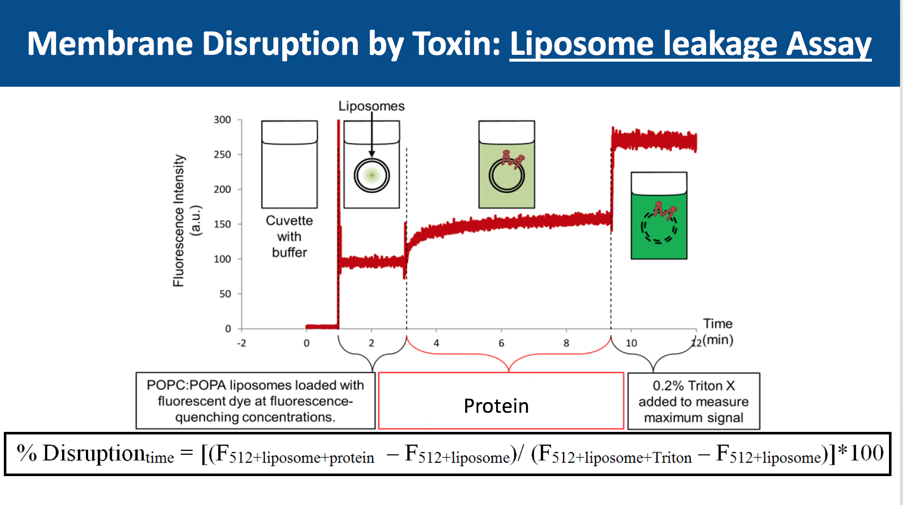
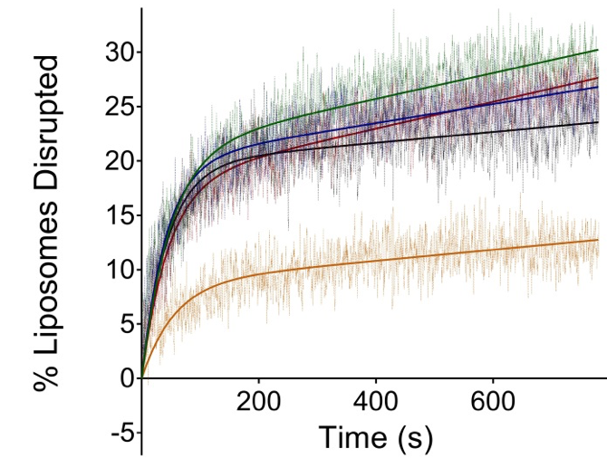
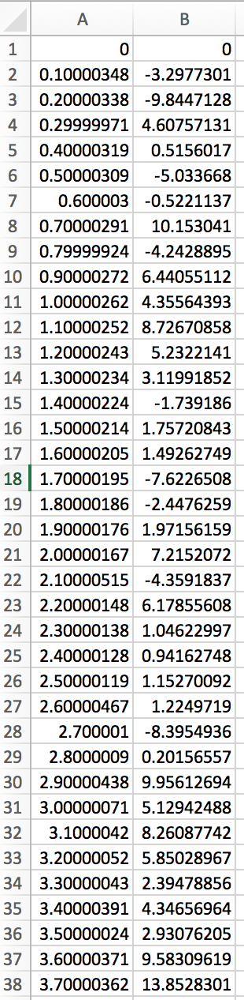

% Analysis of Membrane disruption by a toxin
% John Jimah
% 2018.12.11

# Testing membrane disruption by a toxin
Analyzed data

# Example data of Toxin lysing a membrane

# Example of Unprocessed data

# Scatter plot code
Rmport pandas as pd
import matplotlib.pyplot as plt
df  = pd.read_csv("data.csv")
df.plot()  # plots all columns against index
df.plot(kind='scatter',x='x',y='y') # scatter plot
df.plot(kind='density')  # estimate density function
# df.plot(kind='hist')  # histogram
# Next step: 
Fitting and replication
# Acknowledgements
BioF309 class and teachers
